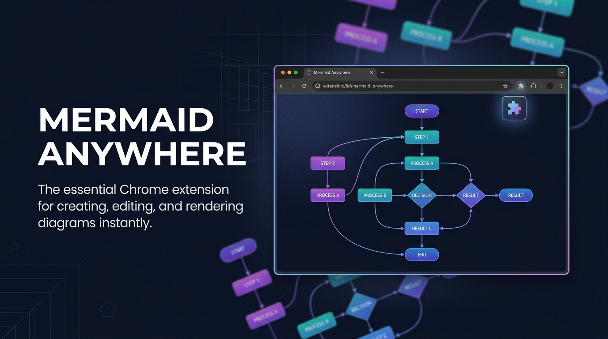

<p align="center">
  
</p>

<p align="center">
  <strong>Render Mermaid diagrams on any web page — automatically.</strong><br/>
  A Chrome extension that detects Mermaid code blocks and replaces them with rendered SVG diagrams.<br/>
  Built by <a href="https://starmorph.com">Starmorph</a> · Full editor at <a href="https://mermaideditor.io">mermaideditor.io</a>
</p>

<p align="center">
  <a href="https://github.com/starmorph/mermaid-anywhere/blob/main/LICENSE"></a>
  <a href="https://github.com/starmorph/mermaid-anywhere"></a>
  <a href="https://github.com/starmorph/mermaid-anywhere/issues"></a>
  
  
</p>

<p align="center">
  <a href="https://chromewebstore.google.com/detail/mermaid-anywhere-diagram/placeholder">
    
  </a>
</p>

---

## Why Mermaid Anywhere?

- **Zero-click rendering.** Mermaid code blocks on ChatGPT, GitHub, Stack Overflow, and Confluence are automatically replaced with rendered SVG diagrams — no copying, no pasting, no extra steps.
- **Works everywhere.** Detects Mermaid syntax via CSS class selectors and keyword matching across 21 diagram types, including dynamically loaded content on SPAs.
- **Private by design.** Zero data collection, zero network requests, zero tracking. All rendering happens locally in your browser. Fully open source.

## Get Started

```bash
pnpm install
pnpm build
```

Load the `dist/` folder as an unpacked extension in `chrome://extensions` with Developer mode enabled.

> Requires Node.js 18+ and pnpm. Chrome or any Chromium-based browser (Edge, Brave, Arc, Vivaldi).

## How It Works

```
Content Script → Service Worker → Offscreen Document (mermaid.js) → SVG back via Shadow DOM
```

The content script scans every page for Mermaid code blocks. When found, it sends the source to an offscreen document where Mermaid.js renders it to SVG. The result is injected back into the page inside a Shadow DOM container for complete style isolation.

The offscreen document pattern is required because Mermaid v10+ uses `Function()` internally, which Chrome extension CSP blocks in content scripts and service workers.

## Features

### Auto-Detection

Finds Mermaid code blocks using multiple strategies:

```
pre > code.language-mermaid    # GitHub, dev.to
pre > code.lang-mermaid        # Some markdown renderers
code.mermaid / div.mermaid     # Generic / Mermaid convention
Keyword matching               # flowchart, sequenceDiagram, erDiagram, etc.
```

Supports all 21 Mermaid diagram types: flowcharts, sequence diagrams, class diagrams, ER diagrams, Gantt charts, state diagrams, pie charts, mind maps, git graphs, timelines, Sankey diagrams, architecture diagrams, and more.

### Built-in Toolbar

Every rendered diagram includes a floating toolbar:

| Action | What it does |
|--------|-------------|
| **Edit in Mermaid Editor** | Opens the code in [mermaideditor.io](https://mermaideditor.io) with theme presets and export |
| **Copy SVG** | Copies the rendered SVG to clipboard for Figma, Slides, etc. |
| **Show/Hide Code** | Toggle between rendered diagram and original source |

### SPA Support

MutationObserver watches for dynamically loaded content, so diagrams render even on single-page apps like ChatGPT and Confluence where content streams in after page load.

### Shadow DOM Isolation

Each diagram is wrapped in a Shadow DOM container. The extension's styles never leak into the host page, and the host page's CSS never affects the diagrams.

## Supported Sites

| Site | What renders |
|------|-------------|
| ChatGPT / Claude | Mermaid code blocks in AI responses |
| GitHub | README files, issues, PRs, comments |
| Stack Overflow | Questions and answers |
| Confluence / Jira | Wiki pages, issue descriptions |
| Notion | Code blocks marked as Mermaid |
| GitLab | Issues, merge requests, wikis |
| Dev.to / HackMD | Blog posts, documents |
| **Any website** | Any page with `language-mermaid` code blocks |

## Permissions

| Permission | Why |
|-----------|-----|
| `activeTab` | Access the current tab to detect Mermaid code blocks |
| `offscreen` | Create an offscreen document for Mermaid.js rendering (CSP workaround) |

No host permissions. No cookies. No network requests. No browsing history access.

## Development

```bash
pnpm install       # Install dependencies
pnpm dev           # Start dev server with HMR
pnpm build         # Production build to dist/
```

### Load in Chrome

1. Run `pnpm build`
2. Open `chrome://extensions/`
3. Enable "Developer mode"
4. Click "Load unpacked" → select the `dist/` folder

### Project Structure

```
src/
├── content/           # Content script (runs on every page)
│   ├── detector.ts    # Finds Mermaid code blocks
│   ├── injector.ts    # Replaces code with rendered SVGs + toolbar
│   ├── styles.ts      # Shadow DOM styles
│   └── index.ts       # Entry point + MutationObserver
├── offscreen/         # Offscreen document for mermaid.js
│   ├── offscreen.html
│   └── offscreen.ts
├── shared/            # Shared types and constants
│   ├── constants.ts   # Mermaid keywords, editor URL builder
│   └── messages.ts    # Message type definitions
└── background.ts      # Service worker (message routing + idle cleanup)
```

## Links

- [Mermaid Editor](https://mermaideditor.io) — Full-featured online Mermaid diagram editor with AI, themes, and export
- [Extension Landing Page](https://mermaideditor.io/extension) — Screenshots, features, and documentation
- [Mermaid.js](https://mermaid.js.org/) — The diagramming library that powers this extension
- [Report a Bug](https://github.com/starmorph/mermaid-anywhere/issues) — Open an issue on GitHub

## License

[MIT](./LICENSE). Free to use, modify, and distribute.

Copyright 2026 Starmorph.
